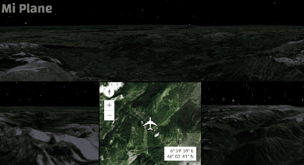
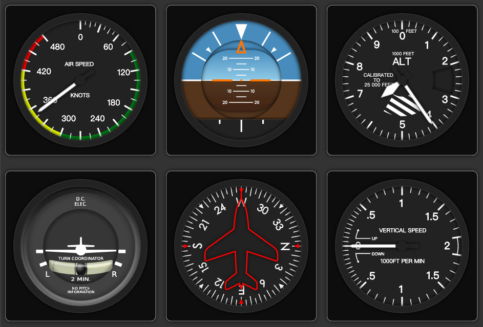

# Mi Plane

The best Flight Simulator in your browser. Based on Node.js and Websocket.

## Screenshots

The App in Action:





## Install

To clone and run this repository you'll need [Git](https://git-scm.com) and [Node.js](https://nodejs.org/en/download) (which comes with [npm](http://npmjs.com)) installed on your computer. [Python3](https://python.org) and pip3 is required if you want to use PS4 controller.

From your command line:
```bash
# Clone this repository
git clone https://github.com/stevenjoezhang/Mi-Plane.git
# Go into the repository
cd Mi-Plane
# Install dependencies
npm install
# Run the app
npm start
```

Next you need to open your browser to view it. Please see the following introduction to features.

## Feature

The App provides several views in the cockpit.

### Main view

WebGL is required to render the canvas. Please make sure your browser supports WebGL and hardware acceleration is enabled, otherwise the map may not be rendered. Use Chrome for better performance.

### Indicators view

仪表设计参考：http://www.dof.cn/redstar/lesson/2instru/basicins.htm

https://www.quora.com/Airplanes/What-do-all-the-controls-in-an-airplanes-cockpit-do/answer/Tim-Morgan-5

| 仪表名 | 中文 | 接受输入 |
| - | - | - |
| airspeed | 空速表 | speed |
| attitude | 姿态指示仪 | roll,pitch |
| altimeter | 高度表 | altitude,pressure |
| turn_coordinator | 转弯、侧滑指示仪 | turn |
| heading | 远读式陀螺罗盘 | heading |
| variometer | 升降速率表 | vertical_speed |

向仪表盘传递的参数为：
speed,roll,pitch,altitude,turn,heading

pressure由altitude计算，vertical_speed由altitude做差/求导计算。

### Panel view

## 简写对照

| 简写 | 全称 | 中文 |
| - | - | - |
| PWR | Power | 节流阀位置 |
| NAV | Navigator | 导航（航路点） |
| SPD | Speed | 地速 |
| HDG | Heading | 航向 |
| ALT | Altitude | 高度 |
| VS | Vertical Speed | 升降速率 |
| A/P | Auto Pilot | 自动驾驶 |

TRIM,FLAPS,SPOILERS,GEAR,BREAKS等与起降有关的内容不做处理。

地速为水平分量。暂时无法计算空速。

## 控制

### 用户输入

micro:bit传感器自由度：倾角（roll,pitch,即俯仰和转向）和节流阀，使用时需按键配平；

使用键盘、鼠标可以进行更详尽的操作。

### AP设置内容

在A/P开启时，不接受输入（或在操作幅度较大时解除A/P）。

## 数据结构与算法

### 概述
为保证参数自洽性，所有输入参数通过Websocket传递到服务器进行计算，然后向各个屏幕输出。将运算与现实分离。

服务器以30Hz发送plane。各终端反馈的方式为发送json到服务器，规范为：

| type | 描述 | 接受输入 |
| - | - | - |
| analog_input | 模拟输入（双轴） | speed |
| set | 设置plane值 | roll,pitch |
| autopilot | 设置autopilot | altitude,pressure |

### Camera
在转向过程中，需要改变Camera的tilt

## TODO

- [ ] ICAO 航路点，在A/P中设置
- [ ] 允许通过A/P设置自动油门
- [ ] 允许用户手动调整Camera参数
- [ ] GPWS
- [ ] HUD
- [ ] FDR & CVR
- [ ] Sensitive

https://developer.mozilla.org/zh-CN/docs/Web/API/Gamepad_API/Using_the_Gamepad_API

## Credits

This application makes use of the following libraries:

- [ArcGIS API for JavaScript](https://developers.arcgis.com/javascript/) by [Esri](http://www.esri.com/)  
  *Esri's JavaScript library for mapping and analysis.*
- [d3-format](https://github.com/d3/d3-format) by [Mike Bostock](https://github.com/mbostock)  
  *Format numbers for human consumption.*
- [jQuery](http://jquery.com/) by jQuery Foundataion Inc  
  *A JavaScript framework for DOM manipulation and a foundation for many other frameworks.*

This application is inspired by the following GitHub repos:

- [Esri-Flight-Simulator](https://github.com/richiecarmichael/Esri-Flight-Simulator) by [Richie Carmichael](https://github.com/richiecarmichael)  
  *A basic flight simulator with four synchronized views. Live demo: http://maps.esri.com/rc/simulator/index.html*
- [jQuery-Flight-Indicators](https://github.com/sebmatton/jQuery-Flight-Indicators) by [Matton Sébastien](https://github.com/sebmatton)  
  *The Flight Indicators Plugin allows you to display high quality flight indicators using html, css3, jQuery and SVG vector images.*

## License
Released under the GNU General Public License v3  
http://www.gnu.org/licenses/gpl-3.0.html
